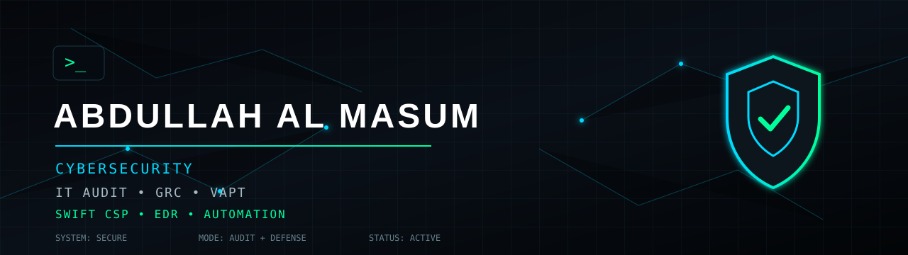
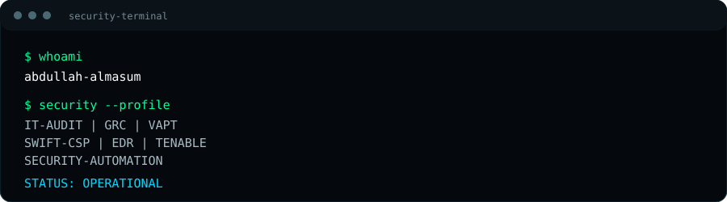
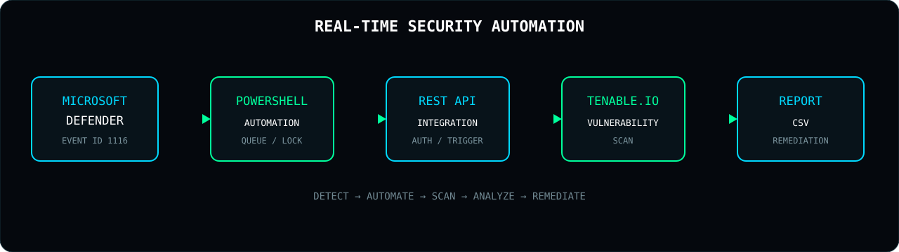

<div align="center">



<br>

# ABDULLAH AL MASUM

### Cybersecurity • IT Audit • GRC • VAPT • Security Automation

<p>
  <b>IT Auditor</b> • <b>CISA</b> • <b>CEH</b> • <b>CCNA</b> • <b>SWIFT CSP</b>
</p>

<p>
  <a href="https://github.com/abdullah-almasum">
    
  </a>
  
  
</p>

</div>

---

# `whoami`

```text
Name        : Abdullah Al Masum
Role        : IT Auditor / Cybersecurity Professional
Focus       : Information Security • IT Audit • GRC • VAPT
Specialty   : SWIFT CSP Assessment • Vulnerability Management
Automation  : PowerShell • Ansible • API Integration
Security    : EDR • SIEM • Tenable • Microsoft Defender
Frameworks  : ISO 27001 • NIST CSF • SWIFT CSCF • ITGC
Certs       : CISA • CEH • CCNA
```

I work across **cybersecurity, information security, IT audit, GRC, vulnerability management, and security automation**.

My work combines security assessment with practical technical implementation — from validating security controls and audit evidence to vulnerability scanning, threat detection, remediation planning, and automation.

---

# `security_identity`



### What I do

- 🔐 Information Security & IT Audit
- 🛡️ GRC & Security Control Assessment
- 🌐 SWIFT CSP / CSCF Assessment
- 🔎 Vulnerability Assessment & Management
- ⚔️ VAPT — Windows / Linux / Network / Web
- 🚨 EDR / Threat Detection
- 📊 SIEM / SOC / Log Analysis
- ⚙️ Security Automation
- 🔌 API-based Security Integration
- 🧩 ITGC & Access Control
- 📋 ISO/IEC 27001 implementation & audit
- 🏦 Financial-sector cybersecurity assessment

<br clear="right"/>

---

# `security_stack`

## 🛡️ Security Arsenal

| Domain | Technologies / Tools |
|---|---|
| **Vulnerability Management** | Tenable.io • Nessus • Vulnerability Scanning • Remediation |
| **EDR / Endpoint Security** | Microsoft Defender • Event ID 1116 • Threat Detection |
| **SIEM / SOC** | Splunk • Log Analysis • Security Monitoring |
| **VAPT** | Burp Suite • Nmap • Kali Linux • Web/API Testing |
| **Automation** | PowerShell • Ansible • REST API • JSON |
| **Infrastructure** | Windows Server • Linux • Networking • TCP/IP |
| **Audit / GRC** | ISO 27001 • ITGC • Risk Assessment • SoA |
| **Financial Security** | SWIFT CSP • CSCF • SCP |
| **Frameworks** | NIST CSF • OWASP • CIS |
| **Cloud / Platforms** | Tenable.io • Microsoft Security ecosystem |

---

# `security_domains`

## 🔬 Core Cybersecurity Domains

```text
                    ┌────────────────────────────┐
                    │       CYBERSECURITY        │
                    └──────────────┬─────────────┘
                                   │
          ┌────────────────────────┼────────────────────────┐
          │                        │                        │
          ▼                        ▼                        ▼
     IT AUDIT / GRC             VAPT                 THREAT DEFENSE
          │                        │                        │
          ├─ ISO 27001             ├─ Web VAPT              ├─ EDR
          ├─ ITGC                  ├─ Network VAPT          ├─ SIEM
          ├─ Risk                  ├─ API Testing           ├─ Monitoring
          ├─ Controls              ├─ Vulnerability         └─ Detection
          └─ Compliance            └─ Remediation
                                   │
                                   ▼
                         SECURITY AUTOMATION
                                   │
                          ┌────────┼────────┐
                          │        │        │
                       PowerShell Ansible  API
```

---

# `featured_project`

## 🚨 Real-Time Threat Response & Vulnerability Scanning

### `EDR → Automation → Tenable`

**Project:**

> Real-Time API-Based Threat Response and Vulnerability Scanning Framework Using EDR and Tenable Integration.

The project connects endpoint threat detection with vulnerability management through automation.

### Workflow

```text
Microsoft Defender
       │
       │ Event ID 1116
       ▼
Threat Detection
       │
       ▼
PowerShell Automation
       │
       ├── Event Parsing
       ├── Queue Management
       ├── Scan Lock
       └── API Authentication
       │
       ▼
Tenable.io API
       │
       ▼
Vulnerability Scan
       │
       ▼
Scan Completion
       │
       ▼
CSV Report
       │
       ▼
Security Analysis
       │
       ▼
Remediation
```



### Key capabilities

- Microsoft Defender Event ID `1116` monitoring
- Automated threat-event processing
- Tenable.io API integration
- Sequential vulnerability scanning
- Global scan locking
- Queue-based execution
- Scan completion monitoring
- Automated CSV report generation
- Timestamped security logging
- MTTD / MTTR measurement
- Security remediation workflow

### Example output

```text
Auto_TenableReport_<ScanID>_<Serial>.csv
```

Logs:

```text
C:\logs\defender-events-csv-1116\
```

---

# `it_audit`

## 📋 IT Audit & GRC

### Governance

- Information Security Governance
- Security Policies & Procedures
- Risk Management
- Asset Management
- Security Governance
- Management Review

### IT General Controls

- Access Management
- User Provisioning / Deprovisioning
- Privileged Access
- Change Management
- Backup & Recovery
- Logging & Monitoring
- Operations Security
- Incident Management

### Technical Controls

- Network Security
- Endpoint Security
- Server Hardening
- Vulnerability Management
- Patch Management
- Firewall Controls
- Authentication
- Encryption
- Security Monitoring

### Audit lifecycle

```text
Audit Planning
      ↓
Scope Definition
      ↓
Risk Assessment
      ↓
Control Identification
      ↓
Evidence Request
      ↓
Evidence Validation
      ↓
Control Testing
      ↓
Finding Identification
      ↓
Risk Rating
      ↓
Management Discussion
      ↓
Final Report
      ↓
Remediation Tracking
      ↓
Follow-up Assessment
```

---

# `swift`

## 🏦 SWIFT CSP / Financial Security

### SWIFT Security Assessment

```text
SWIFT CSP
   │
   ├── CSCF
   │    ├── Mandatory Controls
   │    └── Advisory Controls
   │
   ├── Shared Compliance Programme
   │
   ├── Architecture Review
   │
   ├── Control Assessment
   │
   ├── Evidence Validation
   │
   ├── Vulnerability Assessment
   │
   └── Final Assessment Report
```

### Experience areas

- SWIFT CSP Assessment
- CSP v2024 / v2025
- SWIFT CSCF
- Shared Compliance Programme
- Security Control Assessment
- Evidence Validation
- Audit Planning
- Client Audit Preparation
- Log Validation
- Remediation Planning
- Final Reporting

### SWIFT ecosystem concepts

```text
Alliance Access
       │
       ▼
     SNL
       │
       ▼
Alliance Gateway
       │
       ▼
   Network
       │
       ▼
     SWIFT
```

---

# `vapt`

## ⚔️ VAPT & Offensive Security

### Areas

```text
Reconnaissance
      ↓
Enumeration
      ↓
Service Discovery
      ↓
Vulnerability Identification
      ↓
Validation
      ↓
Risk Assessment
      ↓
Evidence Collection
      ↓
Remediation Recommendation
      ↓
Retesting
```

### Technical areas

- Web Application Security
- API Security
- Network Security
- Windows Security
- Linux Security
- Authentication Testing
- Access Control Testing
- Configuration Review
- Vulnerability Validation
- Security Headers
- TLS / SSL Review
- OWASP Top 10
- Network Enumeration

### Tools

```text
Kali Linux
Nmap
Burp Suite
Tenable
Nessus
Metasploit
Wireshark
PowerShell
Linux CLI
```

---

# `automation`

## ⚙️ Security Automation

I focus on reducing repetitive security operations through automation.

### Automation architecture

```text
Security Event
     │
     ▼
Detection Layer
     │
     ▼
Automation Engine
     │
     ├── Parse
     ├── Validate
     ├── Queue
     ├── Trigger
     └── Monitor
     │
     ▼
Security API
     │
     ▼
Assessment / Scan
     │
     ▼
Report
     │
     ▼
Remediation
```

### Technologies

- PowerShell
- Ansible
- REST APIs
- JSON
- CSV
- Python
- GitHub Actions
- Windows Event Logs
- Microsoft Defender
- Tenable.io API

---

# `frameworks`

## 🧩 Security Frameworks & Standards

| Framework / Standard | Focus |
|---|---|
| **ISO/IEC 27001** | ISMS / Information Security |
| **NIST CSF** | Identify / Protect / Detect / Respond / Recover |
| **SWIFT CSCF** | Financial messaging security |
| **OWASP Top 10** | Web application security |
| **CIS Controls** | Security best practices |
| **ITGC** | General IT controls |
| **Bangladesh Bank ICT Security** | Financial-sector security controls |

---

# `risk`

## 🎯 Risk & Control Mindset

```text
Asset
  ↓
Threat
  ↓
Vulnerability
  ↓
Likelihood
  ↓
Impact
  ↓
Risk
  ↓
Control
  ↓
Residual Risk
  ↓
Treatment
```

### Audit finding mindset

Every finding should answer:

```text
WHAT?
  ↓
What control failed?

WHY?
  ↓
Why did it happen?

RISK?
  ↓
What could happen?

EVIDENCE?
  ↓
What proves the finding?

RECOMMENDATION?
  ↓
How should it be fixed?

OWNER?
  ↓
Who should fix it?

TARGET?
  ↓
When should it be fixed?

RETEST?
  ↓
Has remediation been validated?
```

---

# `certifications`

## 🎓 Certifications

<p>


</p>

### Professional focus

```text
CISA
 ├── IT Governance
 ├── Risk Management
 ├── Audit Process
 ├── IT Operations
 └── Protection of Information Assets

CEH
 ├── Ethical Hacking
 ├── Network Security
 ├── Vulnerability Assessment
 └── Offensive Security

CCNA
 ├── Networking
 ├── Routing
 ├── Switching
 └── Network Security
```

---

# `technical_stack`

## 💻 Technical Stack

### Security

<p>


</p>

### Automation

<p>


</p>

### Infrastructure

<p>


</p>

---

# `security_philosophy`

## 🧠 Security Philosophy

```text
                 SECURITY
                    │
        ┌───────────┼───────────┐
        │           │           │
      PEOPLE      PROCESS    TECHNOLOGY
        │           │           │
        └───────────┼───────────┘
                    │
                 CONTROL
                    │
                 EVIDENCE
                    │
                 ASSURANCE
                    │
                 RESILIENCE
```

> **Security is not only about finding vulnerabilities.  
> It is about understanding risk, validating controls, reducing exposure,  
> automating repeatable processes, and improving resilience.**

---

# `current_focus`

## 🚀 Current Focus

```text
[✓] IT Audit & GRC
[✓] SWIFT CSP Assessment
[✓] ISO 27001
[✓] Vulnerability Management
[✓] VAPT
[✓] Microsoft Defender / EDR
[✓] Tenable.io
[✓] Security Automation
[✓] API Integration
[→] Threat Detection Automation
[→] Security Engineering
[→] Cybersecurity Architecture
```

---

# `github`

## 📊 GitHub Security Lab


### What you'll find here

```text
Security Automation
       │
       ├── PowerShell
       ├── Python
       └── API Integration

Cybersecurity Labs
       │
       ├── VAPT
       ├── Network Security
       ├── Web Security
       └── Vulnerability Management

IT Audit / GRC
       │
       ├── Audit Checklists
       ├── Risk Assessment
       ├── Control Testing
       └── Security Documentation

Research
       │
       ├── EDR
       ├── SIEM
       ├── Threat Detection
       └── Security Automation
```

---

# `repositories`

## 📂 Recommended Repository Portfolio

I organize projects around practical cybersecurity problems.

| Repository | Purpose |
|---|---|
| `real-time-threat-response` | EDR + Defender + Tenable automation |
| `security-automation` | PowerShell / Python / API automation |
| `vulnerability-management` | Vulnerability scanning & remediation |
| `vapt-lab` | Ethical hacking / VAPT laboratory |
| `it-audit-grc-toolkit` | IT audit / GRC resources |
| `swift-csp-toolkit` | SWIFT CSP assessment resources |

> Pin your strongest 6 repositories on your GitHub profile.

---

# `engineering`

## 🔧 Engineering Principles

```text
Secure by Design
       +
Automate Repetitive Work
       +
Validate with Evidence
       +
Measure Risk
       +
Document Everything
       +
Retest Remediation
       =
Security Assurance
```

---

# `learning`

## 📚 Continuous Learning

Current areas of interest:

- Cybersecurity Engineering
- Security Architecture
- Threat Detection
- Vulnerability Management
- Security Automation
- API Security
- Cloud Security
- GRC Automation
- Digital Forensics
- SOC Engineering
- Zero Trust
- DevSecOps

---

# `contact`

## 🌐 Connect

<p align="center">

<a href="https://github.com/abdullah-almasum">

</a>

</p>

---

<div align="center">


### `SECURE • ASSESS • AUTOMATE • IMPROVE`

<sub>
Cybersecurity • IT Audit • GRC • VAPT • SWIFT CSP • Security Automation
</sub>

</div>
